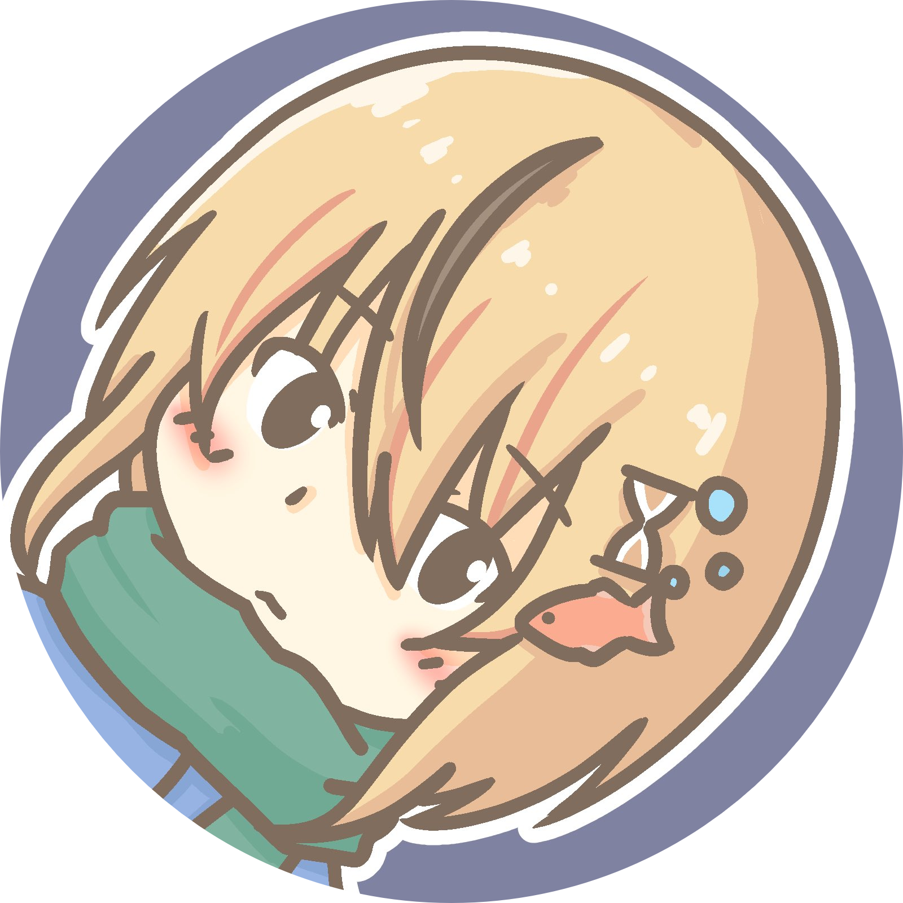

- ⚙️ <mark>Working as</mark>: <ruby>Security researcher<rt><ins>セキュリティ研究者</ins></rt></ruby>, <ruby>Bug bounty hunter<rt><ins>バグバウンティハンター</ins></rt></ruby> 
- 🏢 <mark>Company</mark>:  [Flatt Security Inc.](https://flatt.tech/en/)
-  <mark>Twitter</mark>: [@ryotkak](https://twitter.com/ryotkak)
- 🌐 <mark>Website</mark>: [ryotak.net](https://ryotak.net)
- 📖 <mark>Blog</mark>: [blog.ryotak.net](https://blog.ryotak.net)

A little easter egg... <kbd>Alt+Shift+R</kbd>
